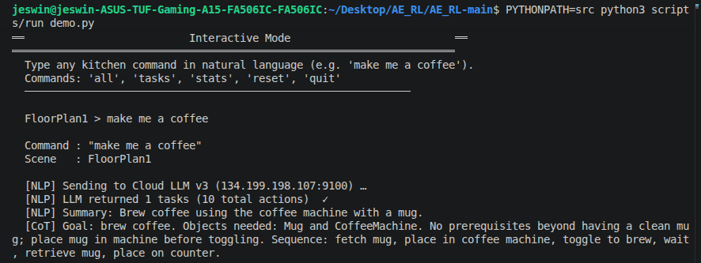
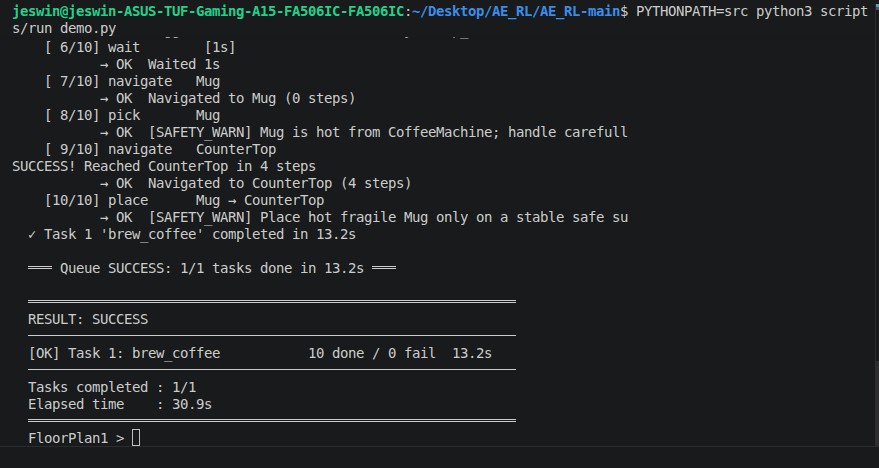
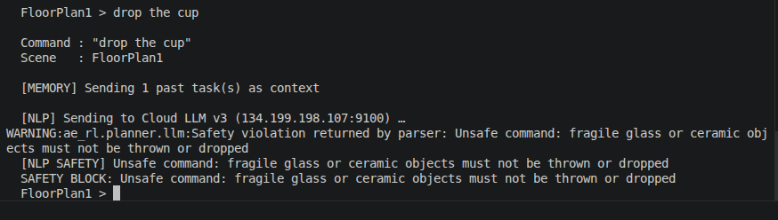
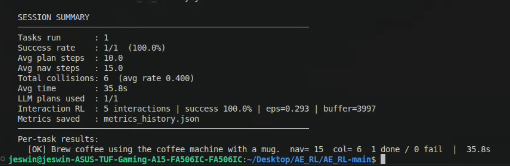

# A Safe Hierarchical Framework for Embodied AI with Multi-Layer Safety Filtering and Recovery Mechanism

## Overview

This project presents a safe hierarchical embodied AI framework for interactive command execution in AI2-THOR environments. The system combines Large Language Models (LLMs), hierarchical Deep Reinforcement Learning, multi-layer safety validation, fault recovery mechanisms, and memory-guided decision making to ensure safe and reliable task execution.

The framework converts natural language commands into executable actions while continuously validating safety constraints before and during execution.

---

## Key Features

- Natural language command understanding using Cloud LLMs
- Multi-layer safety filtering pipeline
- Hierarchical DDQN-based task execution
- Runtime safety monitoring
- Failure detection and recovery
- Memory-guided decision making
- AI2-THOR kitchen environment integration
- Safe execution of household tasks

---

## System Architecture

The framework follows a hierarchical pipeline:

1. User provides a natural language command.
2. Cloud LLM parses the command into executable tasks.
3. Five-layer safety pipeline validates the generated plan.
4. Safety-aware executor performs feasibility and recovery checks.
5. Hierarchical DDQN controllers execute actions.
6. AI2-THOR environment performs the task.
7. Results are returned as:
   - PASS
   - FAIL
   - BLOCKED

### Architecture Diagram

<p align="center">
  
</p>

---

## Safety Pipeline

The proposed framework employs five safety layers:

### L1: Deterministic Semantic Command Filter
Blocks explicitly unsafe commands.

### L2: Open-Vocabulary Risk Guard
Detects potentially dangerous instructions.

### L3: Plan Validator
Verifies action sequence correctness.

### L4: Thermal-Material Runtime Check
Monitors hazardous object interactions.

### L5: Relational Kitchen Scene Safety
Ensures scene-aware safe operation.

---

## Fault Recovery Mechanism

The framework includes:

- Precondition Verification
- Failure Detection
- Class-Aware Recovery
- Memory-Guided Correction
- Graceful Degradation

These mechanisms allow the agent to recover from errors instead of immediately terminating execution.

---

## Memory System

The agent maintains a two-layer memory structure:

### Scene-Local Memory
Stores current environment information.

### Persistent Semantic Memory
Stores previous task knowledge and execution history.

---

## Reinforcement Learning Controllers

Three hierarchical DDQN controllers are used:

### Navigation Controller
Responsible for movement and path planning.

### Task Controller
Handles task-level decision making.

### Interaction Controller
Performs object interactions and manipulation actions.

---

## Example Task Execution

### User Command

```text
make me a coffee
```

### LLM Generated Plan

```text
1. Navigate to Mug
2. Pick Mug
3. Navigate to CoffeeMachine
4. Place Mug
5. Toggle CoffeeMachine
6. Wait
7. Navigate to Mug
8. Pick Mug
9. Navigate to CounterTop
10. Place Mug
```

---

## Sample Outputs

### Command Parsing

<p align="center">
  
</p>

### Task Planning

<p align="center">
  
</p>

### AI2-THOR Environment

<p align="center">
  
</p>

### Successful Execution

<p align="center">
  
</p>

### Safety Violation Detection

<p align="center">
  
</p>

---

Example unsafe command:

```text
drop the cup
```

The safety framework detects the violation and blocks execution before any unsafe action is performed.

---

### Session Summary and Performance Metrics

<p align="center">
  
</p>

This output provides an execution summary of the agent's performance, including task completion statistics, success rate, average planning steps, navigation metrics, interaction counts, collision statistics, execution time, and generated task history. It helps evaluate the effectiveness of the hierarchical controllers, safety pipeline, and recovery mechanisms during task execution.

The session summary demonstrates successful task completion while tracking important performance indicators that can be used for debugging, analysis, and future optimization of the embodied AI framework.


## Technologies Used

- Python
- AI2-THOR
- GPT-OSS-120B (via vLLM)
- Deep Q-Network (DDQN)
- LSTM
- Reinforcement Learning
- Safety Filtering
- Hierarchical Control Architecture

---

## Results

The framework successfully:

- Executes household tasks from natural language commands.
- Blocks unsafe actions before execution.
- Recovers from execution failures.
- Utilizes memory for improved decision making.
- Maintains safe interaction within AI2-THOR environments.

---

## Future Work

- Multi-room navigation
- Multi-agent collaboration
- Real robot deployment
- Advanced memory architectures
- Learning-based adaptive safety policies

---

## Author

**Vidya Ravunni**

Department of Computer Science and Data Science

St Joseph Engineering College, Mangalore

Internship conducted at NITK Surathkal

---
